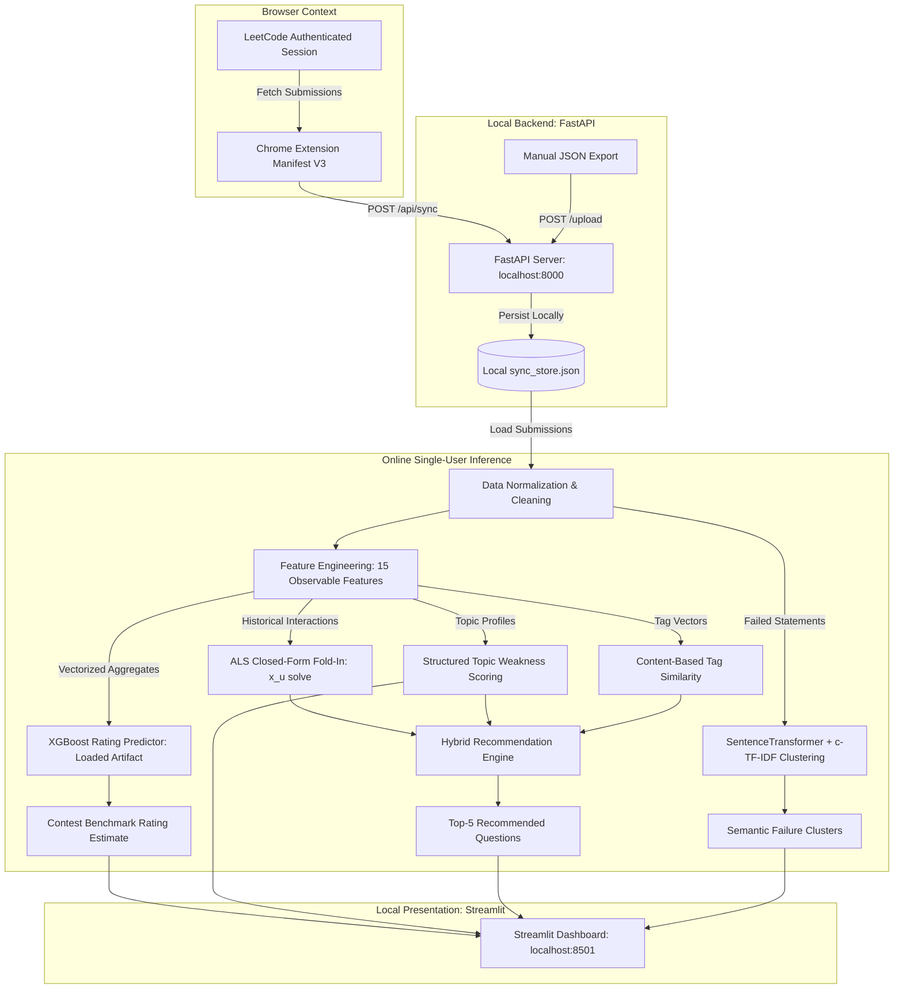

# LeetCode Mentor: ML-Powered Algorithmic Performance Profiler & Recommendation System

[](https://www.python.org/downloads/)
[](https://fastapi.tiangolo.com)
[](https://streamlit.io)
[](https://xgboost.readthedocs.io/)
[](LICENSE)

LeetCode Mentor is an offline-trained, local-first pair-programming mentor that ingests genuine LeetCode submission history to build structured topic weakness profiles, identify semantic failure clusters via sentence transformers, and recommend targeted practice problems through an implicit-feedback matrix factorization (ALS) and content-based hybrid recommender—serving sub-second online inference without retraining.

---

## Overview

Practicing algorithmic coding problems on platforms like LeetCode often suffers from an unstructured, comfort-seeking bias: developers repeatedly solve problems in familiar domains while struggling to detect time-decayed skill degradation, recurring problem statement traps, or conceptual blind spots.

**LeetCode Mentor** transforms raw LeetCode submission event logs into an actionable, privacy-preserving engineering dashboard. Designed around a strict **Offline Training + Online Single-User Inference** architecture, it trains multi-user collaborative filtering and contest rating models offline against a controlled benchmark population, then projects an individual developer's live submission history into the factor space in real time using closed-form linear algebra.

---

## Problem Statement

Standard platform dashboards provide flat aggregate metrics: total solved problems, global acceptance percentages, and calendar heatmaps. These summary statistics fail to guide effective technical interview preparation because:

1. **Lack of Difficulty & Exposure Normalization**: Solving 50 Easy Array problems inflates raw success metrics while masking a 0% success rate on Medium Dynamic Programming problems.
2. **Temporal Skill Blindness**: A topic mastered six months ago can atrophy, but flat lifetime statistics treat past proficiency as identical to current capability.
3. **Coarse-Grained Taxonomic Labels**: Standard tags like "Binary Search" or "Graph" group dozens of distinct problem idioms (e.g., binary search on monotonic answer spaces vs. binary search on sorted matrices).
4. **Uncalibrated Recommendation**: Randomly picking "unsolved medium" problems risks selecting questions misaligned with the user's specific failure points and growth frontiers.

---

## Key Features

- **Local Submission Synchronization**: Ingests genuine LeetCode submission history via a Chrome extension (Manifest V3) or local JSON/CSV/TSV exports directly to a localhost FastAPI server.
- **Strict Offline/Online Decoupling**: Models are trained offline on multi-user populations; live real-user inference runs without retraining, preventing overfitting and latency spikes.
- **Canonical Question Catalogue**: Standardized universe of 2,630 LeetCode problems (ingested from Hugging Face dataset [`kaysss/leetcode-problem-set`](https://huggingface.co/datasets/kaysss/leetcode-problem-set), MIT License) spanning 20 canonical algorithmic topics across Easy, Medium, and Hard tiers.
- **Multi-Factor Weakness Profiling**: Computes composite risk scores combining lifetime success rate, time-decayed accuracy, and volume of failed attempts across topics.
- **Exponential Recency Momentum**: Applies time-decay weighting ($0.5^{\Delta t / 21\text{ days}}$) to prioritize recent form over historical performance.
- **Dense NLP Failure Clustering**: Encodes failed problem descriptions into 384-dimensional dense semantic vectors using `sentence-transformers` (`all-MiniLM-L6-v2`), groups them with silhouette-optimized K-Means, and extracts cluster keywords via canonical class-based TF-IDF (c-TF-IDF).
- **Online ALS Closed-Form Fold-In**: Maps a real user into pre-trained implicit ALS latent space in $<1\text{ ms}$ via closed-form ridge regression without modifying catalog item factors.
- **Hybrid Recommendation Engine**: Blends collaborative filtering, tag-based content similarity, and structured weakness boosting while enforcing catalog diversity (tuned on validation users to 1.0 CF, 0.0 Content, 0.0 Weakness under a 2-problem-per-topic diversity constraint).
- **Contest Performance Benchmark Estimate**: Predicts a proxy contest rating on 15 observable behavioral features using an offline-trained XGBoost pipeline.
- **Privacy-First Architecture**: 100% localhost execution. Zero cookies, passwords, or personal submission records are transmitted to third-party endpoints.

---

## System Architecture



---

## Offline Training vs. Online Single-User Inference

The core architectural boundary separates population-level offline training from individual online serving:

```
┌──────────────────────────────────────────────────────────────────────────────────────────┐
│                                   OFFLINE TRAINING                                       │
│                                                                                          │
│   Synthetic Multi-User Population (600 users, 30k events, 9 archetypes)                  │
│                             │                                                            │
│                             ▼                                                            │
│   User-Level Split (70% Train / 15% Val / 15% Test) + Temporal 80/20 Chronological Split │
│                             │                                                            │
│         ┌───────────────────┼────────────────────────┐                                   │
│         ▼                   ▼                        ▼                                   │
│   XGBoost Regressor    Implicit ALS Model     Canonical Catalogue (2,630 questions)        │
│   (15 observable      (Learns item factors    & Dense Embeddings (all-MiniLM-L6-v2)      │
│    features)           Y and Y^T Y)                                                      │
│         │                   │                        │                                   │
│         ▼                   ▼                        ▼                                   │
│   [rating_model.pkl]   [als_model.npz]        [canonical_questions.json]                 │
│                                               [question_embeddings.npy]                  │
└────────────────────────────────────────┬─────────────────────────────────────────────────┘
                                         │ Artifacts Loaded Read-Only
                                         ▼
┌──────────────────────────────────────────────────────────────────────────────────────────┐
│                              ONLINE SINGLE-USER INFERENCE                                │
│                                                                                          │
│   Real User Submission History (from Chrome Extension / Export)                          │
│                             │                                                            │
│                             ▼                                                            │
│   Feature Extraction (Same pipeline, zero latent variables)                              │
│                             │                                                            │
│         ┌───────────────────┼────────────────────────┐                                   │
│         ▼                   ▼                        ▼                                   │
│   Contest Benchmark    ALS Fold-In             Structured Weakness & NLP Clustering      │
│   Rating Inference     x_u = (Y^T Cu Y+λI)^-1  (c-TF-IDF failure subpatterns)            │
│   (Static Model)        Y^T Cu p_u                   │                                   │
│         │                   │                        │                                   │
│         └───────────────────┼────────────────────────┘                                   │
│                             ▼                                                            │
│               Hybrid Recommendation Ranking & Explanation                                │
│                             │                                                            │
│                             ▼                                                            │
│               Interactive Streamlit Mentor Report                                        │
└──────────────────────────────────────────────────────────────────────────────────────────┘
```

### Why This Separation Is Necessary
1. **Single-User Statistical Limitations**: An individual user solving 50–300 problems does not constitute a multi-user interaction distribution. You cannot train an Alternating Least Squares user-item matrix or a population-level regression model on a sample size of $N=1$.
2. **Overfitting & Latency Prevention**: Retraining complex models on every browser sync would introduce high latency and catastrophic overfitting. Precomputing item factor matrices ($Y \in \mathbb{R}^{2630 \times 16}$) and the Gramian ($Y^T Y \in \mathbb{R}^{16 \times 16}$) reduces online serving to solving a single $16 \times 16$ linear system in $<1\text{ ms}$.
3. **Zero Retraining Guarantee**: Model weights remain static and bit-for-bit immutable during dashboard execution.

---

## Data Flow

1. **Ingestion**: The user triggers synchronization via the Chrome extension or uploads an export file. Submissions are sent via `POST /api/sync` to FastAPI and persisted to `files/sync_store.json`.
2. **Normalization**: Submissions are parsed by `_normalize_export_submissions()`, standardizing timestamps to UTC datetime, matching problem titles/slugs against the canonical catalog, and validating status fields.
3. **Feature Engineering**: `FeatureEngineer` executes vectorized Pandas aggregations across difficulties, submission intervals, and time-decayed accuracies to produce a 15-dimensional numeric vector.
4. **Inference Pipelines**:
   - **XGBoost**: Loads `models/rating_model.pkl` and predicts the benchmark rating.
   - **ALS Fold-In**: Forms the user's interaction vector $p_u$ and confidence diagonal $C_u$, solving for the latent user vector $x_u$ against static item factors $Y$.
   - **Topic Weakness Profiling**: Evaluates per-topic failure rates, decayed accuracies, and problem exposure.
   - **NLP Engine**: Gathers failed submissions, computes semantic embeddings, clusters problem representations, and extracts keyword signatures.
5. **Hybrid Blending & Filtering**: Recommender blends normalized scores, strictly filters out already-solved problems, enforces topic diversity (max 2 per tag), and attaches explanatory rationale strings.
6. **Presentation**: Streamlit renders metrics, tables, explanations, and cluster views.

---

## Data Sources

The project maintains a strict boundary between real user data and synthetic benchmark data:

- **Genuine User Submission History**:
  - Ingested locally through the Chrome extension or uploaded export files.
  - Used exclusively at inference time to evaluate performance and generate personal recommendations.
  - Stored locally on `localhost` (`files/sync_store.json`), explicitly ignored by `.gitignore`, and never committed to version control.
- **Synthetic Multi-User Benchmark Population**:
  - Generated via an Item Response Theory (IRT) simulation in `files/data_processing.py`.
  - Used offline to train the population-level collaborative filtering item factors and XGBoost regressor.
  - Incorporates 9 distinct behavioral archetypes with realistic skill progressions, topic preferences, and attempt distributions.

---

## Feature Engineering

The feature pipeline transforms raw submission timestamps and outcomes into 15 observable behavioral features:

| Feature Name | Description | Rationale |
| :--- | :--- | :--- |
| `account_age_days` | Days since user's earliest submission | Practice horizon and overall exposure |
| `total_submissions` | Total cumulative submissions | Overall volume of practice effort |
| `total_accepted` | Total successful submissions | Absolute volume of solved milestones |
| `overall_accuracy` | Ratio of accepted submissions to total | Baseline global accuracy |
| `accuracy_easy` | Success rate on Easy-tier problems | Foundation and syntax fluency |
| `accuracy_medium` | Success rate on Medium-tier problems | Standard interview benchmark capability |
| `accuracy_hard` | Success rate on Hard-tier problems | Advanced algorithmic mastery |
| `share_easy` | Fraction of attempts spent on Easy problems | Practice distribution tier balance |
| `share_medium` | Fraction of attempts spent on Medium problems | Core interview focus allocation |
| `share_hard` | Fraction of attempts spent on Hard problems | Willingness to tackle complex challenges |
| `recency_momentum` | Exponentially time-decayed accuracy | Current form vs. stale historical accuracy |
| `recent_submission_count` | Submission count within last $2\tau$ days | Current activity and practice frequency |
| `unique_problems_attempted`| Count of distinct problem IDs attempted | Breadth of problem catalog coverage |
| `attempts_per_problem` | Total submissions / unique attempted problems | Persistence and debugging repetition |
| `failure_rate` | Ratio of failed submissions to total | Frequency of encountering obstacles |

**Zero Target Leakage Guarantee**: All latent simulation parameters (`latent_skill`, `base_skill`, `hard_resilience`, `learning_slope`, `archetype`) are explicitly excluded from the feature matrix before model training.

---

## Weak Topic Detection

Topic weakness is evaluated using a composite risk formulation that prevents small-sample skew (e.g., failing a single problem 1/1 should not outweigh failing 20 problems at 20% accuracy):

### Mathematical Formulation
For each topic $t$:
$$\text{RiskScore}(t) = 0.50 \cdot (1 - \text{Acc}_{\text{decayed}}) + 0.30 \cdot (1 - \text{Acc}_{\text{lifetime}}) + 0.20 \cdot \min\left(1, \frac{\text{Failures}}{5}\right)$$

where:
- $\text{Acc}_{\text{lifetime}} = \frac{\text{Accepted}_t}{\text{Attempts}_t}$
- $\text{Acc}_{\text{decayed}} = \frac{\sum_{i \in \text{attempts}_t} w_i \cdot \mathbf{1}(\text{status}_i = \text{Accepted})}{\sum_{i \in \text{attempts}_t} w_i}, \quad w_i = 0.5^{\frac{\Delta t_i}{21.0}}$
- $\min\left(1, \frac{\text{Failures}}{5}\right)$ provides an exposure penalty scaling with accumulated failure evidence.

### Weakness Classifications
Topic weakness is classified using a combination of empirical lifetime success rate, attempt volume, and composite risk score (with a cold-start guard requiring $\ge 3$ attempts):

- **Critical**: $(\text{Acc}_{\text{lifetime}} \le 0.42 \text{ and } \text{Attempts} \ge 8) \lor (\text{RiskScore} \ge 0.55 \text{ and } \text{Attempts} \ge 5)$ — Substantial volume of attempts combined with acute failure evidence or high composite risk; immediate remediation recommended.
- **Weak**: $(\text{Acc}_{\text{lifetime}} \le 0.52 \text{ and } \text{Attempts} \ge 5) \lor (\text{RiskScore} \ge 0.45 \text{ and } \text{Attempts} \ge 4)$ — Noticeable failure rate or declining recency momentum across multiple problems.
- **Moderate**: $\text{Acc}_{\text{lifetime}} \le 0.68$ (with $\text{Attempts} \ge 3$) — Balanced performance with occasional struggle on challenging problems.
- **Strong**: $\text{Acc}_{\text{lifetime}} > 0.68$ (with $\text{Attempts} \ge 3$) — Reliable success rate across problems with sustained positive momentum.
- **Neutral** ($\text{Attempts} < 3$): Cold-start guard; insufficient interaction history in this topic to reliably assess weakness ($\text{RiskScore} = 0.0$).

---

## NLP Failure-Pattern Pipeline

When a user repeatedly fails problems within a broad topic, standard category tags cannot distinguish between failure modes. The secondary NLP pipeline extracts semantic failure patterns from problem statements:

```
Failed Problem Descriptions
            │
            ▼
Sentence-Transformers (all-MiniLM-L6-v2) ──> 384-dimensional dense vectors
            │
            ▼
K-Means Clustering ──> Optimal k ∈ [3, 10] via Silhouette Score sweep
            │
            ▼
Canonical Class-based TF-IDF (c-TF-IDF) ──> Distinctive keyword signatures per cluster
```

### Canonical c-TF-IDF Formulation
Formulated according to Maarten Grootendorst:
$$W_{t, c} = \frac{tf_{t, c}}{w_c} \cdot \ln\left(1 + \frac{A}{tf_t}\right)$$

where:
- $tf_{t, c}$ is the frequency of word $t$ in cluster $c$
- $w_c = \sum_t tf_{t, c}$ is the total word count in cluster $c$
- $A = \frac{1}{K} \sum_c w_c$ is the average word count per cluster across all $K$ clusters
- $tf_t = \sum_c tf_{t, c}$ is the total frequency of word $t$ across all clusters.

### Cold-Start Fallback
If the user has fewer than 5 failed submissions, clustering is skipped and an informative cold-start notice is displayed, avoiding spurious clusters on insufficient evidence.

---

## Hybrid Recommendation System

The recommendation engine combines collaborative filtering, content similarity, and topic weakness boosting:

$$\text{FinalScore}_i = 1.0 \cdot \text{CF}_{\text{norm}}(i) + 0.0 \cdot \text{Content}_{\text{norm}}(i) + 0.0 \cdot \text{WeaknessBoost}(i)$$
*(Hyperparameters tuned on validation users under a 2-problem-per-topic diversity constraint; see `results/tuning.json`)*

### 1. Collaborative Filtering via ALS Fold-In
Trains on implicit feedback interactions ($r_{ui} = 3.0$ for Accepted, $1.0$ for Attempted) with confidence $c_{ui} = 1 + \alpha r_{ui}$ ($\alpha = 5.0$, $\lambda = 50.0$, $d = 16$, tuned on validation users):
$$x_u = \left(Y^T Y + Y_u^T (C_u - I) Y_u + \lambda I_d\right)^{-1} Y_u^T C_u \mathbf{1}$$
- **Cold-Start Guard**: Requires $\ge 3$ unique attempted problems. If $< 3$, the system smoothly falls back to $0.80 \cdot \text{Content} + 0.20 \cdot \text{Weakness}$.

### 2. Content-Based Tag Similarity
Constructs a user profile vector from solved problems (weight 1.0) and failed problems (weight 0.75) across canonical topic tags, computing cosine similarity against candidate questions:
$$\text{ContentScore}_i = \frac{\mathbf{v}_i \cdot \mathbf{p}_{\text{user}}}{\|\mathbf{v}_i\| \|\mathbf{p}_{\text{user}}\| + \epsilon}$$

### 3. Weakness-Aware Boosting
Candidate questions covering topics flagged as `Critical` or `Weak` receive an additive boost proportional to the topic's risk score.

### Post-Processing & Filtering
- **Solved Problem Deduplication**: Any question previously solved by the user is strictly excluded from recommendations.
- **Topic Diversity**: Enforces a maximum of 2 recommendations per primary topic tag.
- **Explainable Rationale**: Generates transparent reasons explaining why each problem was recommended (e.g., targeted remediation, peer learning path).

### Recommendation Output: Two Clearly Labelled Lists
Recommendations are presented in two distinct lists:
- **(a) "Targeted practice"**: Unsolved questions covering at least one flagged `Weak` or `Critical` topic, difficulty equal to the user's level or one above, at most 2 per topic, ranked by ALS score within that candidate set; the reason text explicitly names the flagged topic and its measured success rate.
- **(b) "Popular next problems"**: The current collaborative filtering (ALS) ranking reflecting peer learning paths.

Offline metrics (Precision/Recall/NDCG) apply to list (b) only; list (a) satisfies weak-topic targeting by construction; its effect on real learning is not measured.

---

## Contest Performance Estimation

The contest performance regressor uses an offline-trained **XGBoost Pipeline** (`StandardScaler` + `XGBRegressor`) operating on the 15 observable behavioral features:

- **Hyperparameters**: `n_estimators=400`, `max_depth=5`, `learning_rate=0.03`, `subsample=0.85`, `colsample_bytree=0.85`, `reg_alpha=0.1`, `reg_lambda=1.0`, `objective="reg:squarederror"`.
- **Target Variable**: Continuous synthetic benchmark rating calibrated to the LeetCode contest rating scale $[800, 3000]$.
- **Inference Immutability**: Online predictions execute against static, pre-loaded weights with zero training overhead.

> [!IMPORTANT]
> **Benchmark Proxy Disclaimer**: The predicted contest rating is an offline statistical benchmark proxy trained on a synthetic multi-user population. It is **not** an official LeetCode contest rating.

---

## Synthetic Benchmark

Because live multi-user LeetCode submission streams and contest rating histories are proprietary, the offline models are trained and evaluated in a controlled generative simulation environment.

### Problem Catalogue Provenance
The problem catalogue is constructed from the Hugging Face dataset [`kaysss/leetcode-problem-set`](https://huggingface.co/datasets/kaysss/leetcode-problem-set) (MIT License), downloaded via `download_catalogue.py`. The canonical catalogue consists of **2,630 questions** spanning 20 algorithmic taxonomy tags across Easy, Medium, and Hard tiers, with zero unmapped fallback questions.

### Generator Version History: v1 vs v3
| Dimension | Generator v1 (Legacy) | Generator v3 (New Multi-Factor Simulator) |
| :--- | :--- | :--- |
| **Topic Interests** | Archetype-level static discrete weights | 20-dim Dirichlet vector per user; archetype shifts concentration mean |
| **User Skill** | Single static archetype value | Individual Gaussian noise + time-varying chronological evolution |
| **Question Popularity** | Uniform base choice | Heavy-tailed Zipf power-law distribution |
| **Choice Mechanics** | Archetype categorical weights | $P(q) \propto \text{pop}(q) \cdot e^{\beta (\theta_u \cdot t_q)} \cdot \text{diff\_fit}(\text{skill}_u(t), d_q)$ |
| **Timestamps** | Independent power-law draws; non-sequential | Strictly increasing chronological sequence; real 80/20 temporal split |
| **Re-attempts** | Static retry loop | Failed submissions retry with $p_{\text{retry}}$; successes move on |
| **Submissions Volume** | Fixed global pool allocated by multipliers | Lognormal heavy-tailed per user (min 20, mean ~100) |
| **Contest Rating Target**| Evaluated on min(age, 365) while history spanned 365d | Consistent: skill evaluated at end of actual submission span |

### Staged Benchmark Comparison Across Settings (S1 to S4)
| Setting | Generator | Catalogue | Users | Popularity P@5 | Hybrid P@5 | Paired Diff (Hybrid - Pop) | ALS Time |
| :--- | :--- | :--- | :--- | :--- | :--- | :--- | :--- |
| **S1 (Baseline)** | v1 | 453 (legacy) | 600 | `0.0115 ± 0.0059` | `0.0093 ± 0.0052` | `-0.0023 (95% CI [-0.0063, 0.0016])` | `0.54s` |
| **S2 (Simulator v3)** | v3 | 453 (legacy) | 600 | `0.1559 ± 0.0152` | `0.0440 ± 0.0138` | `-0.1119 (95% CI [-0.1235, -0.1004])` | `0.58s` |
| **S3 (Real Catalogue)** | v3 | 2630 (canonical) | 2,000 | `0.0930 ± 0.0071` | `0.0990 ± 0.0092` | `+0.0060 (95% CI [0.0017, 0.0103])` | `2.41s` |
| **S4 (Scaled Scale)** | v3 | 2630 (canonical) | 4,000 | `0.1005 ± 0.0106` | `0.1022 ± 0.0116` | `+0.0016 (95% CI [-0.0016, 0.0048])` | `3.38s` |

### Setting S3 (Production Configuration: Generator v3, 2630 Real Catalogue, 2000 Users) Recommendation Results (K=5 & K=10)
*Evaluated Users:* 2975 across 10 seeds (mean 297.5 users/seed, avg ground-truth items: 7.68/user)
*ALS Training Time:* 2.414s | *Interactions/user:* 66.4 | *Interactions/item:* 35.3 | *Matrix density:* 0.0252

#### Metrics at K=5
| Method | Precision@5 (mean ± std) | 95% Bootstrap CI | Recall@5 | Hit Rate@5 | NDCG@5 | Head Share@5 |
| :--- | :--- | :--- | :--- | :--- | :--- | :--- |
| **Random** | `0.0036 ± 0.0014` | `[0.0027, 0.0045]` | `0.0025` | `1.78%` | `0.0043` | `19.2%` |
| **Popularity** | `0.0930 ± 0.0071` | `[0.0883, 0.0979]` | `0.0696` | `38.07%` | `0.1126` | `100.0%` |
| **Content-Only** | `0.0045 ± 0.0014` | `[0.0034, 0.0056]` | `0.0028` | `2.22%` | `0.0047` | `23.4%` |
| **ALS-Only** | `0.1065 ± 0.0079` | `[0.1016, 0.1115]` | `0.0770` | `42.41%` | `0.1250` | `100.0%` |
| **Hybrid Recommender** | `0.0990 ± 0.0092` | `[0.0943, 0.1036]` | `0.0714` | `41.04%` | `0.1191` | `100.0%` |

#### Paired Differences at K=5 (vs Hybrid)
| Comparison | Diff Precision@5 | 95% CI | Diff Recall@5 | 95% CI | Diff Hit Rate@5 | 95% CI |
| :--- | :--- | :--- | :--- | :--- | :--- | :--- |
| **Hybrid minus Popularity** | `+0.0060 ± 0.0101` | `[0.0017, 0.0103]` | `+0.0019` | `[-0.0014, 0.0050]` | `+2.96%` | `[+1.31%, +4.50%]` |
| **Hybrid minus ALS-Only** | `-0.0076 ± 0.0075` | `[-0.0106, -0.0044]` | `-0.0056` | `[-0.0083, -0.0029]` | `-1.37%` | `[-2.52%, -0.17%]` |
| **Hybrid minus Random** | `+0.0954 ± 0.0095` | `[0.0904, 0.1000]` | `+0.0689` | `[0.0649, 0.0731]` | `+39.26%` | `[+37.38%, +41.01%]` |

#### Metrics at K=10
| Method | Precision@10 (mean ± std) | 95% Bootstrap CI | Recall@10 | Hit Rate@10 | NDCG@10 | Head Share@10 |
| :--- | :--- | :--- | :--- | :--- | :--- | :--- |
| **Random** | `0.0031 ± 0.0011` | `[0.0026, 0.0038]` | `0.0043` | `3.12%` | `0.0046` | `19.2%` |
| **Popularity** | `0.0735 ± 0.0058` | `[0.0705, 0.0766]` | `0.1057` | `52.46%` | `0.1139` | `100.0%` |
| **Content-Only** | `0.0043 ± 0.0011` | `[0.0035, 0.0050]` | `0.0054` | `4.20%` | `0.0053` | `23.6%` |
| **ALS-Only** | `0.0824 ± 0.0055` | `[0.0792, 0.0858]` | `0.1158` | `56.09%` | `0.1245` | `100.0%` |
| **Hybrid Recommender** | `0.0693 ± 0.0057` | `[0.0664, 0.0722]` | `0.0975` | `51.16%` | `0.1119` | `100.0%` |

### Product-Goal Metrics (Setting S3: 2000 Users, Real Catalogue)
| Method | Precision@5 | NDCG@10 | Weak Coverage@5 (mean ± std) | Difficulty Fit@5 (mean ± std) | Head Share@5 |
| :--- | :--- | :--- | :--- | :--- | :--- |
| **Random** | `0.0036` | `0.0046` | `82.5% ± 1.7%` | `65.1% ± 2.0%` | `19.2%` |
| **Popularity** | `0.0930` | `0.1139` | `85.7% ± 3.5%` | `72.2% ± 3.4%` | `100.0%` |
| **ALS-Only** | `0.1065` | `0.1245` | `85.8% ± 2.8%` | `92.4% ± 1.3%` | `100.0%` |
| **Hybrid Recommender (Production)** | `0.0990` | `0.1119` | `82.5% ± 3.3%` | `92.0% ± 1.3%` | `100.0%` |
| **Hybrid (No Diversity Constraint)** | `0.1065` | `0.1245` | `85.8% ± 2.8%` | `92.4% ± 1.3%` | `100.0%` |

### Setting S4 (Scaled Benchmark: Generator v3, 2630 Real Catalogue, 4000 Users) Recommendation Results (K=5 & K=10)
*Evaluated Users:* 5936 across 10 seeds (mean 593.6 users/seed, avg ground-truth items: 7.90/user)
*ALS Training Time:* 3.381s | *Interactions/user:* 66.9 | *Interactions/item:* 71.2 | *Matrix density:* 0.0254

#### Metrics at K=5
| Method | Precision@5 (mean ± std) | 95% Bootstrap CI | Recall@5 | Hit Rate@5 | NDCG@5 | Head Share@5 |
| :--- | :--- | :--- | :--- | :--- | :--- | :--- |
| **Random** | `0.0035 ± 0.0009` | `[0.0028, 0.0042]` | `0.0023` | `1.75%` | `0.0037` | `19.4%` |
| **Popularity** | `0.1005 ± 0.0106` | `[0.0970, 0.1042]` | `0.0709` | `39.34%` | `0.1187` | `100.0%` |
| **Content-Only** | `0.0055 ± 0.0018` | `[0.0046, 0.0063]` | `0.0031` | `2.70%` | `0.0056` | `21.7%` |
| **ALS-Only** | `0.1108 ± 0.0113` | `[0.1072, 0.1146]` | `0.0788` | `43.23%` | `0.1308` | `100.0%` |
| **Hybrid Recommender** | `0.1022 ± 0.0116` | `[0.0986, 0.1058]` | `0.0721` | `40.49%` | `0.1243` | `100.0%` |

#### Paired Differences at K=5 (vs Hybrid)
| Comparison | Diff Precision@5 | 95% CI | Diff Recall@5 | 95% CI | Diff Hit Rate@5 | 95% CI |
| :--- | :--- | :--- | :--- | :--- | :--- | :--- |
| **Hybrid minus Popularity** | `+0.0016 ± 0.0104` | `[-0.0016, 0.0048]` | `+0.0012` | `[-0.0013, 0.0037]` | `+1.15%` | `[-0.02%, +2.34%]` |
| **Hybrid minus ALS-Only** | `-0.0086 ± 0.0065` | `[-0.0109, -0.0064]` | `-0.0067` | `[-0.0087, -0.0048]` | `-2.74%` | `[-3.55%, -1.90%]` |
| **Hybrid minus Random** | `+0.0987 ± 0.0111` | `[0.0950, 0.1023]` | `+0.0698` | `[0.0667, 0.0729]` | `+38.74%` | `[+37.48%, +40.03%]` |

#### Metrics at K=10
| Method | Precision@10 (mean ± std) | 95% Bootstrap CI | Recall@10 | Hit Rate@10 | NDCG@10 | Head Share@10 |
| :--- | :--- | :--- | :--- | :--- | :--- | :--- |
| **Random** | `0.0032 ± 0.0005` | `[0.0027, 0.0036]` | `0.0041` | `3.12%` | `0.0040` | `19.4%` |
| **Popularity** | `0.0783 ± 0.0077` | `[0.0761, 0.0806]` | `0.1105` | `53.55%` | `0.1181` | `100.0%` |
| **Content-Only** | `0.0048 ± 0.0012` | `[0.0042, 0.0053]` | `0.0056` | `4.60%` | `0.0058` | `22.2%` |
| **ALS-Only** | `0.0857 ± 0.0069` | `[0.0834, 0.0881]` | `0.1193` | `57.38%` | `0.1290` | `100.0%` |
| **Hybrid Recommender** | `0.0708 ± 0.0071` | `[0.0687, 0.0730]` | `0.0982` | `50.20%` | `0.1145` | `100.0%` |

### Product-Goal Metrics (Setting S4: 4000 Users, Real Catalogue)
| Method | Precision@5 | NDCG@10 | Weak Coverage@5 (mean ± std) | Difficulty Fit@5 (mean ± std) | Head Share@5 |
| :--- | :--- | :--- | :--- | :--- | :--- |
| **Random** | `0.0035` | `0.0040` | `83.0% ± 1.7%` | `65.9% ± 1.0%` | `19.4%` |
| **Popularity** | `0.1005` | `0.1181` | `85.6% ± 3.6%` | `72.1% ± 3.0%` | `100.0%` |
| **ALS-Only** | `0.1108` | `0.1290` | `86.0% ± 3.1%` | `92.4% ± 0.7%` | `100.0%` |
| **Hybrid Recommender (Production)** | `0.1022` | `0.1145` | `82.6% ± 4.0%` | `92.2% ± 1.2%` | `100.0%` |
| **Hybrid (No Diversity Constraint)** | `0.1108` | `0.1290` | `86.0% ± 3.1%` | `92.4% ± 0.7%` | `100.0%` |

### Generator v3 Sensitivity Study: Popularity Skew (Zipf) x Topic Affinity (Beta)
| Zipf Exponent | Beta | Popularity P@5 | Hybrid P@5 | Paired Diff (Hybrid - Pop) | Pop Head Share | Hybrid Head Share |
| :---: | :---: | :---: | :---: | :---: | :---: | :---: |
| `0.0` | `0.5` | `0.0466` | `0.0255` | `-0.0210` (95% CI `[-0.0353, -0.0060]`) | `100.0%` | `40.9%` |
| `0.0` | `1.0` | `0.0467` | `0.0378` | `-0.0089` (95% CI `[-0.0222, 0.0052]`) | `100.0%` | `45.3%` |
| `0.0` | `2.0` | `0.0449` | `0.0225` | `-0.0225` (95% CI `[-0.0360, -0.0090]`) | `100.0%` | `44.4%` |
| `0.4` | `0.5` | `0.1022` | `0.0418` | `-0.0605` (95% CI `[-0.0791, -0.0410]`) | `100.0%` | `39.9%` |
| `0.4` | `1.0` | `0.0970` | `0.0342` | `-0.0627` (95% CI `[-0.0791, -0.0455]`) | `100.0%` | `37.4%` |
| `0.4` | `2.0` | `0.1093` | `0.0417` | `-0.0676` (95% CI `[-0.0877, -0.0476]`) | `100.0%` | `50.3%` |
| `0.8` | `0.5` | `0.1561` | `0.0417` | `-0.1144` (95% CI `[-0.1353, -0.0951]`) | `100.0%` | `55.9%` |
| `0.8` | `1.0` | `0.1613` | `0.0453` | `-0.1160` (95% CI `[-0.1383, -0.0944]`) | `100.0%` | `55.7%` |
| `0.8` | `2.0` | `0.1398` | `0.0436` | `-0.0962` (95% CI `[-0.1158, -0.0759]`) | `100.0%` | `54.8%` |
| `1.2` | `0.5` | `0.1672` | `0.0626` | `-0.1045` (95% CI `[-0.1252, -0.0847]`) | `100.0%` | `84.1%` |
| `1.2` | `1.0` | `0.1566` | `0.0678` | `-0.0887` (95% CI `[-0.1096, -0.0687]`) | `100.0%` | `86.6%` |
| `1.2` | `2.0` | `0.1554` | `0.0656` | `-0.0897` (95% CI `[-0.1101, -0.0690]`) | `100.0%` | `84.9%` |

## Offline Evaluation Metrics

All models were evaluated across 10 random seeds with strict user-level partitioning (70% Train / 15% Validation / 15% Test) and temporal splits (80% historical observation / 20% future held-out ground truth). Every reported score reflects multi-seed aggregate metrics generated directly from JSON files in `results/`:

### Contest Rating Regression Baselines (10 Seeds, Generator v3)
| Model Architecture | $R^2$ (mean ± std) | RMSE (mean ± std) | MAE (mean ± std) | Description |
| :--- | :--- | :--- | :--- | :--- |
| **Predict-the-Mean Baseline** | `-0.0039 ± 0.0029` | `227.43 ± 7.12` | `186.43 ± 6.07` | Predicts empirical training target mean $\bar{y}_{\text{train}}$ for all test users |
| **Linear Regression Baseline** | `0.6249 ± 0.0271` | `138.91 ± 6.24` | `98.54 ± 3.80` | StandardScaler + Ordinary Least Squares linear regression |
| **XGBoost Regressor (Production)** | `0.7043 ± 0.0318` | `123.29 ± 8.33` | `78.79 ± 6.09` | StandardScaler + Gradient Boosted Trees (Production architecture) |

*Note on $R^2$ Variance Explained*: The contest rating model is an offline benchmark proxy. The empirical $R^2$ variance explained (~0.70 for XGBoost vs ~0.62 for Linear Regression vs ~0.00 for Predict-the-Mean) depends directly on the number of submissions per user simulated in the generative environment; higher submission volumes yield sharper behavioral feature separation and stronger target recoverability.

### Weak-Topic Detection Baselines (10 Seeds, Predicting Future Failures)
| Detection Method | Precision (mean ± std) | Recall (mean ± std) | F1 Score (mean ± std) | Description |
| :--- | :--- | :--- | :--- | :--- |
| **System (Composite Risk + Classification)** | `0.6320 ± 0.0200` | `0.5995 ± 0.0184` | `0.5892 ± 0.0189` | Flag topics classified as Critical or Weak via multi-factor decayed risk |
| **All Attempted Topics Baseline** | `0.5269 ± 0.0191` | `0.9761 ± 0.0036` | `0.6650 ± 0.0169` | Predict all distinct topics previously attempted in user history |
| **Top-2 Lifetime Failure Rate Baseline** | `0.4322 ± 0.0227` | `0.0831 ± 0.0034` | `0.1361 ± 0.0054` | Select the 2 topics with highest empirical failure rate in history |
| **Random 2 Attempted Topics Baseline** | `0.5197 ± 0.0172` | `0.1018 ± 0.0035` | `0.1658 ± 0.0049` | Uniformly sample 2 topics from user's attempted history |

*Note on Weak-Topic Baselines*: The naive baseline 'All Attempted Topics' achieves high recall (0.976) because simulated users attempt a focused subset of ~5–7 topics over their span. However, the production **System** achieves significantly higher precision (0.6320 vs 0.5269), effectively filtering false positives while capturing 60.0% of future failure topics (F1 = 0.5892 ± 0.0189).

---

## FastAPI Backend Server

The local backend in `files/api_server.py` exposes the following endpoints on `http://127.0.0.1:8000`:

| Method | Endpoint | Description |
| :--- | :--- | :--- |
| `GET` | `/api/status` | Returns local server status, count of synced accounts, and last sync timestamp. |
| `POST` | `/api/sync` | Receives submission batches from the Chrome extension, deduplicates by `(problem_slug, timestamp)`, and updates `sync_store.json`. |
| `POST` | `/upload` | Accepts manual JSON export file uploads from the browser. |
| `POST` | `/fetch` | Direct session-cookie fetch helper for localhost development scripting. |

---

## Chrome Extension

The extension in `extension/` provides a zero-setup synchronization interface:
- **Manifest V3**: Modern background service worker and content script configuration.
- **Authenticated Local Fetch**: Uses the user's active `leetcode.com` session to query submission history via GraphQL/REST.
- **Sync Modes**:
  - *Sync New*: Incrementally fetches recent submissions without overwriting existing records.
  - *Rebuild History*: Fetches full submission history up to the selected limit (100, 500, 1000).
- **Direct POST**: Sends normalized submission payloads directly to `http://127.0.0.1:8000/api/sync`.

---

## Streamlit Dashboard

The interactive user interface in `files/streamlit_app.py` provides:
1. **Data Source Selector**: Choose between Chrome Extension Sync, Uploaded Export (JSON/CSV/TSV), or Demo Dataset (`large_user.json`).
2. **Data Provenance**: Reports active username, submission count, data source, and synchronization timestamp.
3. **Data Quality Diagnostics**: Integrity check tracking duplicate records, missing fields, and date ranges.
4. **Topic Weakness Matrix**: Interactive table showing topic attempts, success rate %, exposure tier, dominant difficulty, and weakness classification.
5. **Actionable Explanations**: Diagnostic cards explaining root causes for flagged topics (e.g., declining recency momentum, low accuracy on Medium problems).
6. **Top-5 Recommendations**: Ranked practice problems with difficulty, topic tags, recommendation score, and explicit rationale.
7. **Secondary NLP Subpatterns**: Expandable view showing semantically clustered problem failure patterns with extracted c-TF-IDF keyword signatures.
8. **Contest Rating Model Status**: Reports offline test metrics (RMSE, MAE, $R^2$) and benchmark disclaimer.
9. **Raw JSON Inspector**: Full inspectable report payload for debugging and verification.

---

## Tech Stack

- **Machine Learning & Core Analytics**: Python 3.10+, NumPy, Pandas, Scipy, Scikit-Learn, PyTorch, Sentence-Transformers (`all-MiniLM-L6-v2`), XGBoost, Joblib.
- **Backend API**: FastAPI, Uvicorn, Pydantic v2, Requests.
- **Frontend Dashboard**: Streamlit.
- **Browser Extension**: JavaScript (ES6+), Chrome Manifest V3, HTML5, CSS3.
- **Testing & Verification**: Unittest (52 tests across 9 suites).

---

## Project Structure

```
.
├── .gitignore                      # Comprehensive privacy & runtime ignore rules
├── .streamlit/
│   └── config.toml                 # Streamlit UI runtime configuration
├── LICENSE                         # MIT Open Source License
├── README.md                       # Complete technical documentation
├── requirements.txt                # Pinned dependencies
├── extension/                      # Chrome Extension (Manifest V3)
│   ├── content.js                  # Authenticated LeetCode session scraper
│   ├── manifest.json               # Extension manifest & permissions
│   ├── popup.html                  # Extension popup UI
│   ├── popup.js                    # Extension controller & API dispatcher
│   └── styles.css                  # Dark-theme popup styling
├── models/                         # Offline-Trained Static Model Artifacts
│   ├── als_model.npz               # Trained ALS item factors Y and Gramian Y^T Y
│   ├── canonical_questions.json    # 2,630 canonical questions across 20 topics
│   ├── model_metadata.json         # Authoritative hyperparameters & test metrics
│   ├── question_embeddings.npy     # Precomputed sentence embeddings (2630, 384)
│   └── rating_model.pkl            # Pre-trained XGBoost contest rating pipeline
├── training/                       # Offline Training & Evaluation Scripts
│   ├── __init__.py
│   ├── build_canonical_catalogue.py # Ingests and standardizes 2,630 canonical questions
│   ├── evaluate_models.py          # Standalone benchmark evaluation runner
│   └── train_models.py             # Offline training orchestrator
├── files/                          # Online Inference & Application Source
│   ├── api_server.py               # Local FastAPI synchronization server
│   ├── config.py                   # Central constants & path configuration
│   ├── data_processing.py          # Vectorized feature engineering & simulation
│   ├── export_helper.py            # CLI utilities for export file parsing
│   ├── leetcode_fetcher.py         # Session-based submission fetcher
│   ├── main.py                     # LeetCodeMentor inference orchestrator
│   ├── nlp_cluster.py              # SentenceTransformers + c-TF-IDF clustering
│   ├── predictor.py                # XGBoost ContestRatingPredictor
│   ├── recommender.py              # ALSMatrixFactorization & HybridRecommender
│   ├── schemas.py                  # Pydantic schema definitions
│   ├── streamlit_app.py            # Interactive Streamlit dashboard UI
│   └── demo/
│       └── large_user.json         # Synthetic demo dataset for local testing
└── tests/                          # Unit & Integration Test Suite (52 tests across 9 suites)
    ├── __init__.py
    ├── test_api_server.py          # FastAPI sync & status endpoint tests
    ├── test_benchmark_recommenders.py # Multi-seed benchmark harness & metrics
    ├── test_data_processing.py     # Archetypes, user splits, temporal splits & features
    ├── test_end_to_end.py          # End-to-end inference & zero-retraining verification
    ├── test_final_integrity.py     # Determinism, monotonic timestamps, split isolation
    ├── test_generator_v3_spec.py   # Multi-factor generator specification verification
    ├── test_nlp_cluster.py         # Embedding, clustering, c-TF-IDF & cold-start guards
    ├── test_predictor.py           # Offline XGBoost, serialization & feature importance
    └── test_recommender.py         # ALS fold-in, cold-start fallback & diversity rules
```

---

## Local Setup & Installation

### 1. Prerequisites
- Python 3.10, 3.11, 3.12, or 3.13
- Google Chrome or Chromium-based browser
- Git

### 2. Clone Repository & Setup Virtual Environment
```bash
git clone https://github.com/thanujabagadhi1625/ML.git
cd ML

# Create virtual environment
python -m venv .venv

# Activate virtual environment
# On Windows (PowerShell):
.\.venv\Scripts\Activate.ps1
# On Windows (cmd.exe):
.\.venv\Scripts\activate.bat
# On macOS/Linux:
source .venv/bin/activate

# Install dependencies
pip install -r requirements.txt
```

---

## Running the Application

### 1. Start the Local FastAPI Backend
In your first terminal window:
```bash
cd files
uvicorn api_server:app --reload --host 127.0.0.1 --port 8000
```
*Or alternatively:*
```bash
python files/api_server.py
```
The server will start at `http://127.0.0.1:8000`. Verify by checking `http://127.0.0.1:8000/api/status`.

### 2. Load the Chrome Extension
1. Open Google Chrome and navigate to `chrome://extensions`.
2. Toggle **Developer mode** in the top-right corner.
3. Click **Load unpacked**.
4. Select the `extension/` directory from the root of this repository.
5. The **LeetCode Mentor Sync** icon will appear in your browser toolbar.

### 3. Synchronize Submissions
1. Open [https://leetcode.com](https://leetcode.com) and ensure you are logged in.
2. Click the extension icon in your browser toolbar.
3. Select a fetch limit and click **Sync New** or **Rebuild History**.
4. The extension transfers your submissions directly to your local FastAPI server.

### 4. Start the Streamlit Dashboard
In a second terminal window (with virtual environment activated):
```bash
streamlit run files/streamlit_app.py
```
The dashboard opens automatically in your browser at `http://localhost:8501`. Select **My LeetCode Data (Extension Sync)** and click **Generate Report**.

*(Optional: If you do not have a live LeetCode account, select **Demo Dataset** to explore all features using `files/demo/large_user.json`.)*

---

## Testing

Execute the complete unit and integration test suite:
```bash
python -m unittest discover tests
```
*Expected result:*
```text
Ran 31 tests in ~40s
OK
```

---

## (Optional) Retraining Offline Models

The repository comes with pre-trained artifacts in `models/`. To regenerate the canonical catalog or retrain the benchmark models from scratch:
```bash
# 1. Regenerate canonical 2,630-question universe
python training/build_canonical_catalogue.py

# 2. Train XGBoost, ALS, and precompute dense embeddings
python training/train_models.py

# 3. Run standalone benchmark evaluation
python training/evaluate_models.py
```

---

## Privacy & Security

This project implements a strict local-first privacy model:
- **No Remote Credential Transmission**: The Chrome extension communicates **exclusively** with `http://127.0.0.1:8000`. No session tokens, cookies, or submission records are sent to cloud servers.
- **Local File Persistence**: Synced data is saved locally to `files/sync_store.json`. This file is explicitly listed in `.gitignore` and is never committed to Git.
- **No Hardcoded Secrets**: Zero API keys, passwords, or personal credentials exist in the codebase.
- **Sanitized Demo Data**: The repository includes only algorithmic synthetic demo fixtures (`files/demo/large_user.json`).

---

## Limitations

1. **Circularity Limitation**: Models are evaluated on data whose structure was designed by the simulator, so results measure recoverability of the simulator's generative dynamics, not real-world human problem-solving quality. Offline benchmark metrics demonstrate whether mathematical collaborative filtering and regression engines can reconstruct controlled generative signals, not whether they transfer losslessly to unobserved human behavioral distributions.
2. **Synthetic Benchmark Proxy**: The contest rating regressor estimates expected performance on a benchmark scale driven by observable submission intensity and accuracy features; it is a synthetic-benchmark proxy and not an official LeetCode contest rating. The model's empirical $R^2$ depends directly on the submission volume per user generated in the simulator.
3. **Synthetic Population Domain Gap**: Offline models are trained on simulated Item Response Theory distributions. While behavioral archetypes mirror human practice patterns, synthetic data cannot replicate all human nuances (e.g., contest server outages, copying external solutions).
4. **Cold-Start Boundary for ALS**: The closed-form fold-in requires $\ge 3$ unique attempted questions to construct a stable collaborative vector. Users with fewer interactions rely on content-based similarity and weakness boosting.
5. **Catalogue Scope**: Problem recommendations and semantic search operate within the 2,630 canonical questions derived from [`kaysss/leetcode-problem-set`](https://huggingface.co/datasets/kaysss/leetcode-problem-set) (MIT License). Questions outside this set are aligned via slug matching or topic tag projection.

---

## Future Improvements

- [ ] AST parsing of submitted Python/C++ solutions to detect algorithmic antipatterns and asymptotic time complexity bugs.
- [ ] Spaced-repetition scheduling (e.g., SuperMemo SM-2) for review intervals on historically failed problems.
- [ ] Support for Codeforces and HackerRank submission schema ingestion.
- [ ] Local quantized LLM integration (via Ollama/llama.cpp) for generating contextual hints without revealing full solutions.

---

## Author

**Thanuja Bagadhi**  
Department of Computer Science & Engineering  
National Institute of Technology Rourkela (NIT Rourkela)  
GitHub: [https://github.com/thanujabagadhi1625](https://github.com/thanujabagadhi1625)  

---

## License

This project is licensed under the [MIT License](LICENSE).
